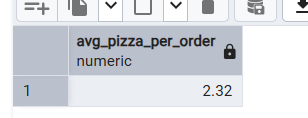

//total revenue
# select sum(total_price::numeric) as total_revenue from pizza_sales_staging;

-- average Order Value
# select Round(sum(total_price::numeric)/count(distinct order_id),2) as avg_order_value from pizza_sales_staging

-- Total Pizzas Sold
# select sum(quantity::numeric) as Total_Pizzas_Sold from pizza_sales_staging;

-- Total Orders
# SELECT count(DISTINCT ORDER_ID::NUMERIC) AS TOTAL_ORDERS FROM PIZZA_SALES_STAGING;

-- Average Pizzas per Order
# SELECT Round(sum(QUANTITY::numeric) / COUNT(DISTINCT ORDER_ID),2) AS AVG_PIZZA_PER_ORDER FROM PIZZA_SALES_STAGING;

